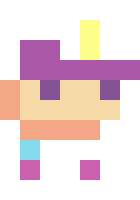
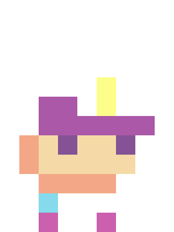
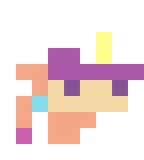
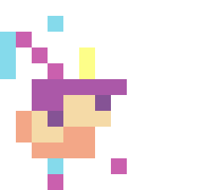
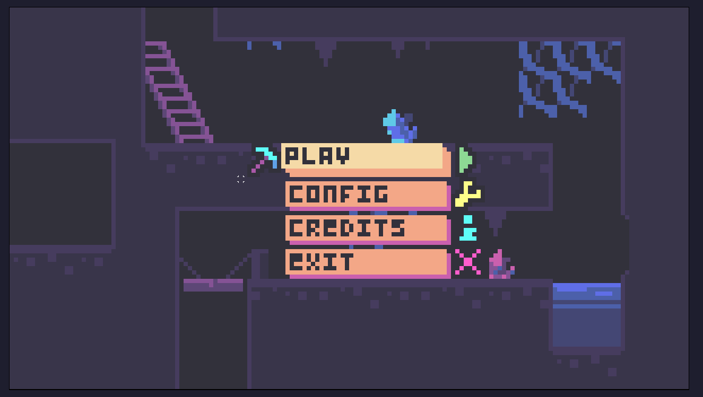
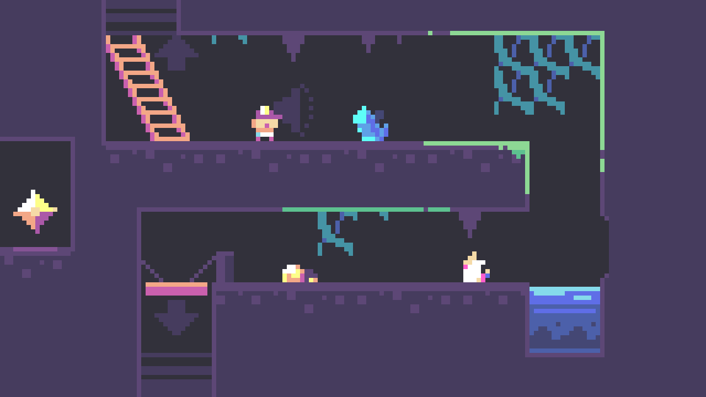
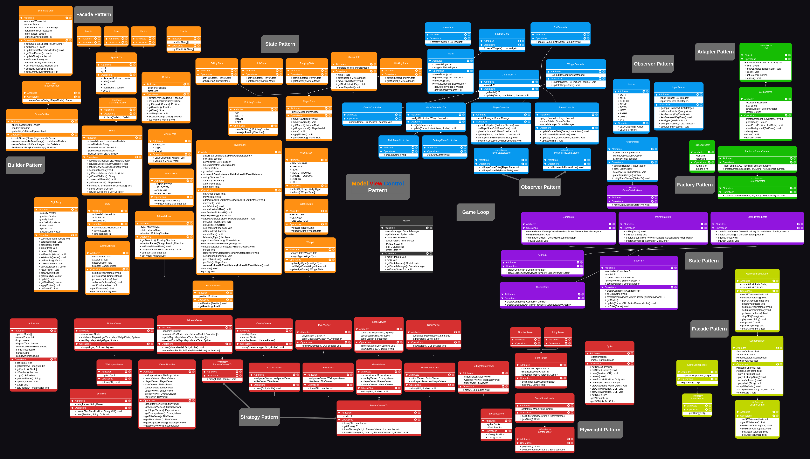

# LDTS_T04_G04 - BOB, THE DESTRUCTOR  

    

    In this project, our main objective is to develop a 2D mining game inspired by titles such as Minecraft and Terraria. The main character is a miner named Bob, as suggested by the game’s title.
Bob starts in the first cave, and his goal is to descend through five caves while collecting as many ores as possible in the shortest amount of time.

>This project was developed by <a href="https://github.com/alexis-ramoss">Aléxis Ramos</a> (up202404977), <a href="https://github.com/T0m2sT">Pedro Tomás Teixeira</a> (up202404987), <a href="https://github.com/Pinho13">Rafael Pinho e Silva</a> (up202406334) for LDTS 2025/26.

For a more detailed version of this description, click [here](./docs/README.md).

Grade: 19.1 

## Mockups

<h3 align="center">
  Main Character Design
</h3>

    
    
    
    

<h3 align="center">
  MainMenu Mockup
</h3>

    

<h3 align="center">
  Game Mockup
</h3>

    

## Game ScreenShots

    

    

    

    

    

    

## General Structure

