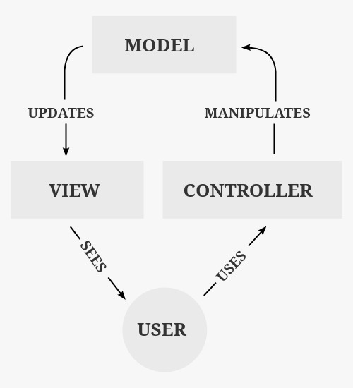
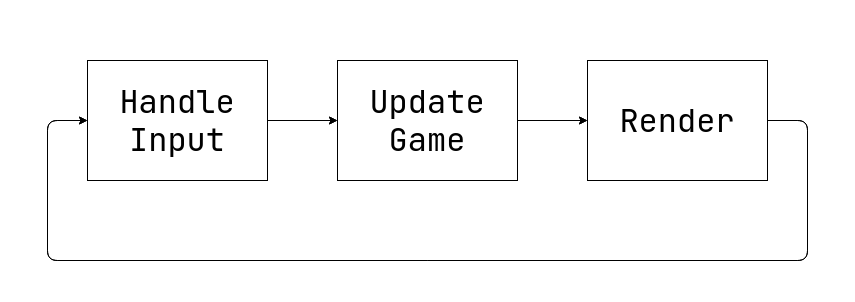
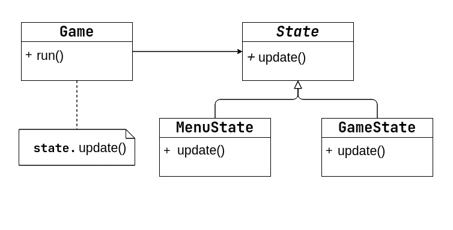
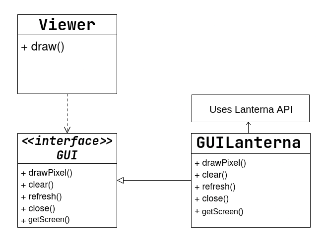

# LDTS_T04_G04 - BOB, THE DESTRUCTOR

In this project, our main objective is to develop a 2D mining game inspired by titles such as Minecraft and Terraria. The main character is a miner named Bob, as suggested by the game’s title.
Bob starts in the first cave, and his goal is to descend through five caves while collecting as many ores as possible in the shortest amount of time.

This project was developed by Aléxis Ramos, Pedro Tomás Teixeira, Rafael Pinho e Silva for LDTS 2025/26.

## Implemented features

* **Sprite Loader** - A class that parses and renders PNGs onto the GUI's screen.
* **Input System** - A system that allows the user to use keyboard inputs, multiple inputs per frame are supported.
* **Action System** - A system that implements the input system into the game by turning any user input into a game action.
* **State System** - A system that allows the game to know in what state it is, and proceeds accordingly.
* **Main Menu** - Menu screen when launching game, this allows the user to choose between starting the game, accessing the settings, accessing the credits or exit the game.
* **Collision System** - A system that allows objects to collide.
* **Physics System** - A system that allows objects to have physics applied to them. (gravity, velocity, acceleration, ...)
* **Player Movement** - A system that allows the player to move.
* **Scene Builder** - A system to build the caves of the game from pngs, creating the collisions and ores (randomly selected).
* **Scene Manager** - A system that selects which caves will appear and in what order, there are in total 10 caves but in each run only 5 will be randomly selected in a random order.
* **Ore System** - A system that allows the player to collect different ores.
* **Sound System** - A system that allows the game to play sounds.
* **Animation System** - A system that allows the game to play animations.
* **UI** - During the game there is also a nice overlay showing how many ores were collected at the current cave and the last caves, and shows you in which cave you are in.
* **End Screen** - Once the player reaches the end, the stats of the run will be showcased.

## Notes About Features

Initially, we aimed for an upgrade system for the core progression of the game and a more open and more traditional mining game.
However, as we progressed through the development of the game, we ended up abandoning those ideas in favour of others. We ended up settling for a more linear gameplay style so we could polish the game even more and make it a better experience to the user.
As a result, some planned features were not implemented, while others were introduced instead.

## General Structure

## Design

### Code Structure

#### Problem in Context

When developing a game or any complex piece of software, it is essential to be very careful with the way it is implemented and structured.
Due to this, it is essential to compartmentalize all the components.

#### The Pattern

We chose the **Model/View/Controller** pattern. This pattern is very common in projects which have to display any kind of interface.
The main idea behind this pattern is dividing the software into three sections:

* **Model** - represents the data and game logic
* **View** - renders the model
* **Controller** - receives and interprets the user inputs

#### Implementation

The following diagram explains the current implementation:

#### Consequences

Benefits:
* Allows for better code organization
* Helps with the segregation of the code
* Avoids conflicts

### Game Loop

#### Problem in Context

In game development it is essential to control the frame rate of a game. Both the rendering and code speed depend on the game's frame rate.

#### The Pattern

The design pattern used to solve this issue is the **Game Loop**. A Game Loop is a while-loop that runs until there is a state change to quit the game.
With this loop there is also a target FPS (frames per second), which represent how manny times per second all the code runs and how manny times the images in the screen are updated.
There is also the need to track the **deltaTime** which is the time between frames. This value is extremely important to maintain compatibility with different FPS, while still maintaining the appropriate behaviour.
This way our game will run continuously and smoothly across different systems and frame rates.

#### Implementation

The implementation of this pattern in our project is present in run method of our [game class](/src/main/java/com/ldtsfeup2526/bobTheDestructor/Game.java).

Here is a visual representation of the game loop:

#### Consequences

Benefits:
* Allows to control frame rate
* Keeps the experience consistent

### Multiple Game States

#### Problem in Context

It is crucial that we support multiple game states. The game should know whether it is currently on the game or in a menu.
This means we can't mix rendering coordination with screen logic, because it would violate the Single Responsibility Principle and made transitions more complex.
This could obviously be solved with some conditionals, this is not a very scalable approach as eventually there would be a giant block of code inside our game.

#### The Pattern

We applied the **State** pattern. Each game state is distinct encapsulating its own model, viewer and controller.
`Game` holds a reference to the current `State<?>` and then it only needs to delegate to it. This way, switching game scene is now replacing the state instance.

States are also the glue for our project structure, containing the model, view and controller. Allowing everything to be updated in order.

#### Implementation

- Core abstraction: [`states/State.java`](/src/main/java/com/ldtsfeup2526/bobTheDestructor/states/State.java#L11-L33). It holds the screen model, a `Controller<T>`, and a `ScreenViewer<T>`, created via factory methods.
- Game loop delegation: [`Game.java`](/src/main/java/com/ldtsfeup2526/bobTheDestructor/Game.java#L43-L61) calls `state.update(gui)` every frame and exposes `setState(...)` for transitions ([`Game.java#setState`](../src/main/java/com/ldtsfeup2526/bobTheDestructor/Game.java#L65-L67)).
- Concrete states: a `GameState` links the `Scene` model with its screen viewer and controller.

Here is a visualization of how it is implemented:

#### Consequences

Benefits:
- Clean separation of concerns between the main loop and screen logic.
- Adding a new screen is simpler: implement a new `State<T>` subclass and its viewer and controller.
- Transitions are explicit and testable via `Game.setState(...)`.

Liabilities:
- More types and indirection.

### Rendering Multiple Elements

#### Problem in Context

As we introduced multiple renderable elements like (player, tiles, decor, etc.), a single monolithic renderer would accumulate `if/switch` chains to handle each type,
making it hard to add new visuals and violating the Open/Closed Principle.

#### The Pattern

We applied the **Strategy pattern** for the drawing method. Each drawable element has its own viewer strategy implementing a common interface.
Screens then will compose these strategies to render the model.

#### Implementation

- Strategy interface: [`view/elements/ElementViewer.java`](../src/main/java/com/ldtsfeup2526/bobTheDestructor/view/game/ElementViewer.java#L6-L8).
- Strategy composition/provider: [`view/ViewerProvider.java`](../src/main/java/com/ldtsfeup2526/bobTheDestructor/view/ViewerProvider.java#L7-L16) instantiates and exposes concrete viewers like `PlayerViewer`.
- Example concrete strategy: [`view/elements/PlayerViewer.java`](../src/main/java/com/ldtsfeup2526/bobTheDestructor/view/game/PlayerViewer.java).
- Screen-level composition: `ScreenViewer<T>` aggregates the strategies to draw a complete screen.

#### Consequences

Benefits:
- New renderable types can be added by creating a new `ElementViewer` implementation while existing code stays closed to modification.
- Testability improves by isolating drawing logic per element.

Liabilities:
- Slight increase in the number of classes and indirection through the provider.

### Simplification of Lanterna's interface

#### Problem in Context

Directly using Lanterna's API can be frustrating and unclear, specially for rendering multiple game elements.
This would mess up portability and made switching or configuring anything harder.

#### The Pattern

We combined **Adapter** and **Factory** patterns:
- **Adapter:** define a minimal `GUI` interface for drawing operations, with `GUILanterna` adapting Lanterna’s `Screen` to that interface.
- **Factory:** centralize creation and also configuration of the `Screen` via a `ScreenCreator`.

#### Implementation

- Adapter (`GUILanterna`): wraps Lanterna and implements drawing methods; see [`gui/GUILanterna.java`](/src/main/java/com/ldtsfeup2526/bobTheDestructor/gui/GUILanterna.java#L19-L81). Notable operations include `drawPixel`, `clear`, `refresh`, and `close`.
- Factory (`ScreenCreator`): interface to build a configured Lanterna `Screen`; see [`gui/ScreenCreator.java`](/src/main/java/com/ldtsfeup2526/bobTheDestructor/gui/ScreenCreator.java#L11-L13). `GUILanterna` delegates actual creation to this factory in `createScreen(...)`.
- Integration in boot: `Game` builds `GUILanterna` with resolution, pixel size, and title; see [`Game.java` constructor](/src/main/java/com/ldtsfeup2526/bobTheDestructor/Game.java#L26-L31).

Here is a visualization of how it is implemented:

#### Consequences

Benefits:
- The view classes uses a stable `GUI` API and is decoupled from Lanterna specific methods.
- Screen creation details, the resolution, font size, window title and KeyListener are centralized, easing configuration and testing.
- Future backends can be introduced by implementing `GUI` and a matching `ScreenCreator`.

Liabilities:
- Additional abstraction layers making it more complex and efficiency might be compromised.

### Input Handling

#### Problem in Context

Raw key events (press/release) are noisy and platform-dependent. Game logic should operate on semantic actions (e.g., `UP`, `JUMP`, `SELECT`) and avoid repeated triggers for single-shot actions while a key is held.
Naive solutions would scatter key-code checks and introduce confusion across controllers.

#### The Pattern

We leveraged the **Observer** style provided by Java AWT (`KeyListener`) to receive events, and applied a small parsing layer that behaves like a Command/Interpreter for inputs: `ActionParser` translates key codes into domain actions and coordinates one-shot behavior using an `InputReader` buffer.

This combination cleanly separates event capture from action semantics. We also abstained from using Lanterna's implementation as it had a few drawbacks.
This implementation allows for multiple Key Events per frame while having a clean implementation separate from the GUI.

#### Implementation

- Event capture buffer: [`controller/input/InputReader.java`](../src/main/java/com/ldtsfeup2526/bobTheDestructor/controller/input/InputReader.java#L9-L56) implements `KeyListener`, maintaining `inputPressed` and `inputFinished` lists; `updateInputPressed()` updates inputs each frame.
- Parsing to actions: [`controller/input/ActionParser.java`](../src/main/java/com/ldtsfeup2526/bobTheDestructor/controller/input/ActionParser.java#L8-L59) maps key codes to `Action` values and marks single-shot actions (`SPACE`, `ENTER`, `ESCAPE`) as finished.
- Wiring in boot: `Game` creates the parser and passes its `InputReader` into the GUI, so the same listener receives events and focuses keyboard while using Lanterna's screen; see [`Game.java` boot](../src/main/java/com/ldtsfeup2526/bobTheDestructor/Game.java#L26-L31).

#### Consequences

Benefits:
- Clear separation between event capture and semantic actions.
- One-shot actions are handled uniformly; held keys don’t cause repeated triggers unless intended.
- Controllers can depend on `Action` lists without caring about AWT details.

Liabilities:
- Requires careful usage of `inputFinished` to avoid starving inputs; controllers must mark single-shot actions appropriately.

### Scene Generation

#### Problem in Context

Creating levels manually is tedious and error-prone. We needed a way to generate levels automatically or semi-automatically, ensuring that the game is replayable and scalable.
Hardcoding positions of blocks and minerals would be a nightmare to maintain.

#### The Pattern

We used the **Builder** pattern to construct the game scene. The `SceneBuilder` reads image files (representing the cave structure and mineral locations) and constructs the `Scene` object with all its components (player, colliders, minerals).

#### Implementation

- Builder Interface: [`model/game/scene/ISceneBuilder.java`](../src/main/java/com/ldtsfeup2526/bobTheDestructor/model/game/scene/ISceneBuilder.java) defines the contract for creating a scene.
- Concrete Builder: [`model/game/scene/SceneBuilder.java`](../src/main/java/com/ldtsfeup2526/bobTheDestructor/model/game/scene/SceneBuilder.java) implements the logic to parse images and create the scene.
- Usage: The `SceneManager` or `GameState` uses the builder to create the scene when the game starts or when transitioning between levels.

#### Consequences

Benefits:
- Decouples the scene construction logic from the scene representation.
- Allows for easy creation of different levels by simply providing different image files.
- Makes the code more readable and maintainable.

Liabilities:
- Requires creating image files for each level, which might be time-consuming if not automated, while also increasing complexity.

### Sound Management

#### Problem in Context

Our game needed to play sound effects and music to be immersive. Managing these sounds, especially playing them, stopping them, and controlling their volume, can become complex if scattered throughout the code.
We needed a centralized way to handle audio resources and playback while also hiding Java's sound API details.

#### The Pattern

We implemented a **Sound Manager** component that follows the **Facade** design pattern. The `SoundManager` provides a simplified interface for audio operations, abstracting the underlying Java Sound API and centralizing sound playback and volume control.

Additionally, the abstract `SoundManager` class defines shared behavior that is extended by `GameSoundManager`, following the *Template Method* pattern.

#### Implementation

- Sound Loader: [`sounds/SoundLoader.java`](../src/main/java/com/ldtsfeup2526/bobTheDestructor/sounds/SoundLoader.java) and [`sounds/GameSoundLoader.java`](../src/main/java/com/ldtsfeup2526/bobTheDestructor/sounds/GameSoundLoader.java) handle loading audio clips from resources.
- Sound Manager: [`sounds/SoundManager.java`](../src/main/java/com/ldtsfeup2526/bobTheDestructor/sounds/SoundManager.java) defines the interface for playing music and SFX, and controlling volume. [`sounds/GameSoundManager.java`](../src/main/java/com/ldtsfeup2526/bobTheDestructor/sounds/GameSoundManager.java) implements this logic.
- Usage: The `Game` class initializes the `SoundManager`, which is then passed to states and controllers. For example, `PlayerController` uses it to play jump or walk sounds.

#### Consequences

Benefits:
- Centralizes audio logic, making it easier to manage and update.
- Abstracts the complexity of the Java Sound API.
- Allows for easy volume control and sound toggling.

Liabilities:
- Introduces an additional abstraction layer, which slightly increases system complexity.

### Physics Engine

#### Problem in Context

Implementing realistic movement and collision detection requires a robust physics system. Handling velocity, acceleration, gravity, and friction manually in every moving object would lead to code duplication and inconsistencies.

#### The Pattern

We encapsulated physics logic within a `RigidBody` class. This class handles all physics-related calculations, such as updating position based on velocity and acceleration, applying gravity, and handling friction.

#### Implementation

- RigidBody: [`model/game/physics/RigidBody.java`](../src/main/java/com/ldtsfeup2526/bobTheDestructor/model/game/physics/RigidBody.java) manages the physics state of an object (position, velocity, acceleration). It provides methods to apply forces (like jumping or moving) and updates the state every frame.
- Collision Detection: [`model/game/physics/CollisionChecker.java`](../src/main/java/com/ldtsfeup2526/bobTheDestructor/model/game/physics/CollisionChecker.java) defines an interface for checking collisions, which is used by the game loop to resolve interactions between objects.

#### Consequences

Benefits:
- Encapsulates complex physics math, keeping other classes clean.
- Ensures consistent physics behavior across all game entities.
- Makes it easier to tweak physics parameters (gravity, friction, etc.) globally or per object.

Liabilities:
- Adds computational overhead, though necessary for a physics-based game.

### Animation System

#### Problem in Context

Static sprites are boring. We wanted to bring the game to life with animations for the player and other elements.
Managing frame updates, looping, and switching between animations manually in the viewer classes would be messy.

#### The Pattern

We created an `Animation` class to handle the logic of cycling through sprite frames. This encapsulates the state of an animation (current frame, elapsed time) and provides a simple interface to update and retrieve the current sprite.

#### Implementation

- Animation Class: [`view/Animation.java`](../src/main/java/com/ldtsfeup2526/bobTheDestructor/view/Animation.java) stores an array of sprites and handles the timing for switching frames. It supports looping and one-shot animations.
- Usage: Viewers (like `PlayerViewer`) hold instances of `Animation` and update them every frame. They then ask the animation for the current sprite to draw.

#### Consequences

Benefits:
- Simplifies the viewer logic by abstracting animation details.
- Allows for easy creation of complex animations with different frame rates and looping behaviors.
- Makes the game visually more appealing.

Liabilities:
- Requires creating and managing multiple sprite images for each animation.

### Sprite Loading

#### Problem in Context

Loading images from disk is a slow operation. If we loaded the same image multiple times (e.g., for every tile of the same type), it would waste memory and performance.
We needed a way to load images once and reuse them.

#### The Pattern

We used the **Flyweight** pattern (or a caching mechanism) in the `SpriteLoader`. The `GameSpriteLoader` maintains a map of loaded sprites. When a sprite is requested, it checks the map first; if it exists, it returns the cached instance; otherwise, it loads it from disk and caches it.

#### Implementation

- Sprite Loader Interface: [`view/sprite/SpriteLoader.java`](../src/main/java/com/ldtsfeup2526/bobTheDestructor/view/sprite/SpriteLoader.java) defines the contract for loading sprites.
- Concrete Loader: [`view/sprite/GameSpriteLoader.java`](../src/main/java/com/ldtsfeup2526/bobTheDestructor/view/sprite/GameSpriteLoader.java) implements the caching logic using a `HashMap`.
- Usage: The `ViewerProvider` and other classes use the `SpriteLoader` to get sprites without worrying about performance overhead.

#### Consequences

Benefits:
- Reduces memory usage by sharing sprite instances.
- Improves performance by avoiding redundant disk I/O.
- Centralizes image loading logic.

Liabilities:
- Requires managing the cache (though in this case, we keep sprites for the lifetime of the game).

### Menu Navigation

#### Problem in Context

Menus often have multiple selectable items (widgets). We needed a way to navigate through these items and keep track of the currently selected one.
Implementing navigation logic in every menu class would lead to code duplication.

#### The Pattern

We created a base `Menu` class that handles the navigation logic. It maintains a list of widgets and an index for the currently selected widget. It provides methods to move the selection up and down.

#### Implementation

- Base Menu Class: [`model/menu/Menu.java`](../src/main/java/com/ldtsfeup2526/bobTheDestructor/model/menu/Menu.java) implements the navigation logic (`moveUp`, `moveDown`) and stores the list of widgets.
- Concrete Menus: `MainMenu`, `SettingsMenu`, etc., extend `Menu` and define their specific widgets.
- Usage: The `MenuController` uses the navigation methods of the `Menu` model to update the selection based on user input.

#### Consequences

Benefits:
- Centralizes navigation logic, reducing code duplication.
- Makes it easy to add new menus with standard navigation behavior.
- Simplifies the controller logic.

Liabilities:
- Assumes a linear list of widgets for navigation.

### Input State Observer

#### Problem in Context

Different game states require different input handling behaviors. For example, in the menu, holding a key should not trigger rapid movement, while in the game, holding a key is necessary for continuous movement.
We needed a way to inform the input parser about the current game state.

#### The Pattern

We used the **Observer** pattern. The `ActionParser` implements `GameStateListener` and observes changes in the game state. When the state changes, the `ActionParser` updates its behavior (e.g., enabling or disabling key hold).

#### Implementation

- Listener Interface: [`states/GameStateListener.java`](../src/main/java/com/ldtsfeup2526/bobTheDestructor/states/GameStateListener.java) defines the `notifyStateChange` method.
- Observer: [`controller/input/ActionParser.java`](../src/main/java/com/ldtsfeup2526/bobTheDestructor/controller/input/ActionParser.java) implements the listener interface and adjusts `allowKeyHold` based on the new state.
- Subject: The `Game` class (or `State` manager) notifies listeners when the state changes.

#### Consequences

Benefits:
- Decouples the input handling logic from the specific state implementations.
- Allows for dynamic adjustment of input behavior based on context.

Liabilities:
- Adds complexity to the input system.

### Player State Machine

#### Problem in Context

The player character has complex behavior: walking, jumping, falling, mining, idling. Managing all these states and transitions with simple boolean flags or if-else statements would quickly become unmanageable and bug-prone while also possibly blocking certain actions like moving while jumping.

#### The Pattern

We implemented the **State** pattern for the player logic. The `PlayerModel` delegates behavior to a `PlayerState` object. Each state (e.g., `WalkingState`, `JumpingState`) implements the specific logic for movement and transitions.

#### Implementation

- State Interface/Abstract Class: [`model/game/elements/Player/PlayerState.java`](../src/main/java/com/ldtsfeup2526/bobTheDestructor/model/game/elements/Player/PlayerState.java) defines the common interface for player actions.
- Concrete States: `IdleState`, `WalkingState`, `JumpingState`, `FallingState`, `MiningState` implement specific behaviors.
- Context: `PlayerModel` holds the current state and forwards requests to it.

#### Consequences

Benefits:
- Cleanly separates the logic for each player state.
- Makes state transitions explicit and easier to manage.
- Simplifies the `PlayerModel` class.

Liabilities:
- Increases the number of classes.

### Event Listener for Pickaxe Hits

#### Problem in Context

When the player hits a mineral with the pickaxe, other parts of the game (like the `SceneController`) need to know about it to handle the destruction of the mineral and the collection of resources.
Directly calling methods on the controller from the player model would create a circular dependency and tight coupling.

#### The Pattern

We used the **Observer** (or Listener) pattern again to help us with it. The `PlayerModel` maintains a list of `PickaxeHitEventListener`s. When a hit occurs, it notifies all registered listeners.

#### Implementation

- Listener Interface: [`controller/game/PickaxeHitEventListener.java`](../src/main/java/com/ldtsfeup2526/bobTheDestructor/controller/game/PickaxeHitEventListener.java) defines the `onPickaxeHit` method.
- Subject: `PlayerModel` allows listeners to register and notifies them when a hit happens.
- Observer: `SceneController` implements the listener interface and handles the game logic for mineral destruction.

#### Consequences

Benefits:
- Decouples the player model from the scene controller.
- Allows multiple components to react to pickaxe hits if needed.

Liabilities:
- Adds complexity with listener registration and notification.

### Player State Listener

#### Problem in Context

The game needs to play sound effects when the player changes state (e.g., walking sound when entering `WalkingState`, jump sound when entering `JumpingState`).
Coupling the sound logic directly inside the `PlayerModel` or `PlayerState` classes would violate the Single Responsibility Principle and make the model dependent on the sound system.

#### The Pattern

Once again, we applied the **Observer** pattern. The `PlayerController` implements `PlayerStateListener` and observes changes in the player's state. When the state changes, the controller triggers the appropriate sound effects via the `SoundManager`.

#### Implementation

- Listener Interface: [`controller/game/PlayerStateListener.java`](../src/main/java/com/ldtsfeup2526/bobTheDestructor/controller/game/PlayerStateListener.java) defines `onPlayerStateEnter` and `onPlayerStateExit`.
- Subject: `PlayerModel` allows listeners to register and notifies them when the state changes.
- Observer: `PlayerController` implements the listener interface and plays sounds based on the state transitions.

#### Consequences

Benefits:
- Decouples the player model from the sound system.
- Keeps the sound logic centralized in the controller (or a dedicated audio controller).

Liabilities:
- Adds another listener interface and registration mechanism.

### Scene Management

#### Problem in Context

The game consists of multiple levels (caves) that need to be loaded sequentially or randomly. Managing the transition between these levels, keeping track of the current level, and handling the overall game progression, for example, the total minerals collected, requires a dedicated component.
Putting this logic in the `GameState` or `Game` class would make them too complex and there are simpler and better solutions.

#### The Pattern

We lightly used a **Facade** pattern (specifically in `SceneManager`). This class acts as the model for the `GameState` and manages the lifecycle of scenes (levels).

#### Implementation

- Manager Class: [`model/game/scene/SceneManager.java`](../src/main/java/com/ldtsfeup2526/bobTheDestructor/model/game/scene/SceneManager.java) handles the list of cave paths, the current scene, and global stats like total minerals collected.
- Usage: `GameState` holds a reference to `SceneManager` and delegates scene-related operations to it. `SceneController` updates the `SceneManager` based on game events, such as, player reaching the bottom of the cave.

#### Consequences

Benefits:
- Encapsulates level management logic.
- Separates the concern of "managing the game session" from "managing a single level".
- Facilitates the implementation of features like level progression and randomization.

Liabilities:
- Adds another layer of abstraction.

## Known code smells

### View-Model Coupling

This is a significant code smell because it violates the **MVC** principle: some models contain logic that triggers actions based on specific animation frames (the player mining when the animation reaches the “hit pickaxe” frame). Ideally, controllers should handle these interactions, possibly by being passed down from the state to the viewers, so that models remain purely passive. However, refactoring the hierarchy at this stage of development would be extremely complex.
In this case, the smell is acceptable: the implementation is clear, manageable, and uses an observer-like approach where the model notifies its listeners (the controllers) for that specific action.

This code smell has only two occurrences, one in [`PlayerViewer`](../src/main/java/com/ldtsfeup2526/bobTheDestructor/view/game/PlayerViewer.java) and the other in [`MineralViewer`](../src/main/java/com/ldtsfeup2526/bobTheDestructor/view/game/MineralViewer.java)

### Switch Statements

In [`WidgetController`](../src/main/java/com/ldtsfeup2526/bobTheDestructor/controller/menu/WidgetController.java) we are using a somewhat long switch statement to determine each widget type behaviour. We tried to solve this problem with a **Command** Pattern, however because the widget types are stored in the Model, this would violate the **MVC** principle.

Additionally, we used switch statements to for handling inputs in the [`ActionParser`](../src/main/java/com/ldtsfeup2526/bobTheDestructor/controller/input/ActionParser.java), but each case only did basic calls.

### Duplicate Code

In the player's states, the logic for state transitions inside the `getNextState()` method is largely similar across most states. We structured the code to prioritize readability, avoiding decoupling it into separate functions, which could have made it less intuitive. Creating additional base state classes to share some of this behavior could be an option, but it would not fully resolve the issue, since each state still has unique transition logic.

## Testing

We focused on unit testing to ensure the reliability of the game's architectural components, specifically the **Model**, **View**, and **State** systems. By isolating these components, we could verify behavior without relying on the complex graphical backend.

#### Testing Strategy:
*   **Models**: We verified that game elements (Player, Blocks, Minerals) hold state correctly and interactions (like collision bounding boxes) function as expected.
*   **Controllers**: We tested the `InputReader` and `ActionParser` to ensure that raw keyboard inputs are correctly translated into semantic game actions (`UP`, `SELECT`, etc.).
*   **Viewers**: We achieved high coverage in the view package by testing the strategy pattern implementations, ensuring the correct symbols and colors are associated with game elements.
*   **States**: We validated that states correctly initialize their respective controllers and viewers.

#### Coverage Summary:
The project achieved a high degree of code coverage, as shown in the report below:

*   **Class Coverage**: 89.7%
*   **Method Coverage**: 91.7%
*   **Line Coverage**: 85.6%

#### Detailed Breakdown:
*   **Core Logic (`model.game`, `states`, `view`)**: These packages achieved **100% line coverage**. This ensures that the core gameplay loop, state transitions, and rendering logic are robust and error-free.
*   **Input Handling (`controller.input`)**: With **89.8% line coverage**, the input system is reliable, ensuring smooth player control.
*   **Untested Areas**: The lower coverage in specific areas (like `model.menu` or parts of the main `Game` loop) is due to these classes being simple data containers or the main entry point, which are verified through manual integration testing.

### Self-Evaluation

| Name | Contribution |
| :---: | :---: |
| Aléxis Ramos | 33.33% |
| Pedro Tomás Teixeira | 33.33% |
| Rafael Pinho e Silva | 33.33% |